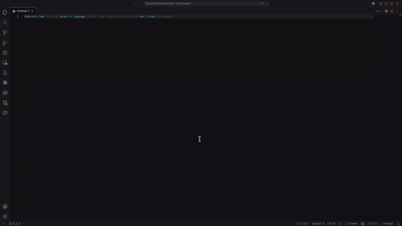

# LiveTem — Snippet Manager

A UI for creating and editing VS Code snippets.

## Features

- Create and edit VS Code snippets with a built-in editor
- Manage snippet scope (global, workspace, language-specific)
- Syntax highlighting and language selection for snippet bodies
- Unsaved-changes indicators

## Usage

Open the command palette (`Ctrl+Shift+P` / `Cmd+Shift+P`) and run:

- **Snippet Manager: Open** — open the snippet manager panel
- **Snippet Manager: New Snippet** — create a new snippet

Or click the LiveTem icon in the activity bar to open the sidebar launcher.

## Requirements

VS Code 1.85.0 or later.
